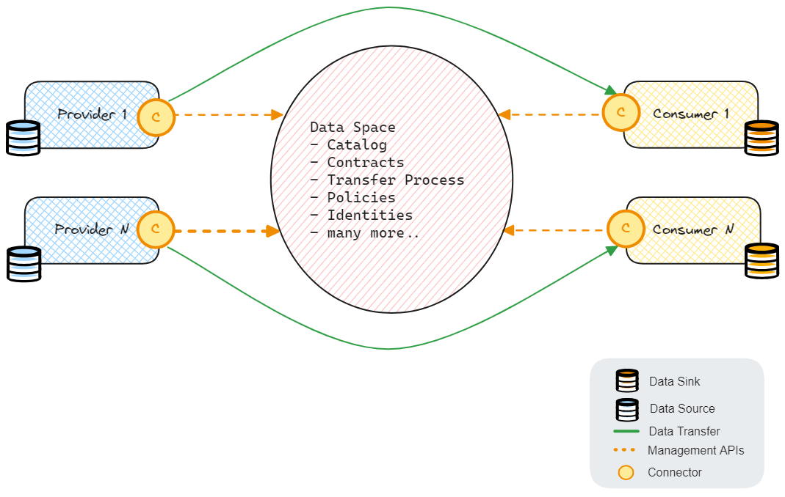
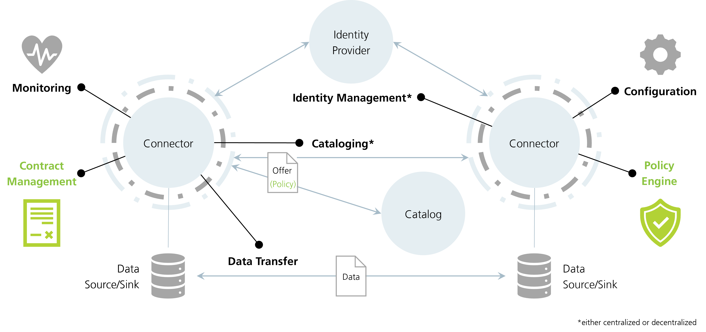

# Data Spaces in HUAWEI CLOUD

## Need for Data Spaces
The unprecedented growth of digital economy in the past decade has to lead to many new data technologies such as
big data, data lakes, data mining, data analysis, business intelligence and many more. These aimed at ingesting vast amounts of complex data
and generate tangible information out of it. Data is also the foundational building block of AI and ML.

All such data processing and consumption techniques were applied mostly on datasets which were centrally hosted
and consumed mostly by the sole owners of the data. But with data becoming the new currency and asset,
the organizations who own data can increase its value only by sharing them across organizations, sectors, domains, borders, etc.

This has lead to the emergence of **data spaces** ecosystem which aims at building frameworks for
decentralized data sharing with the highest level of security, trust, governance and control.

## Complexities of Data Spaces

Even though the business value a data space brings is great, implementing such a data exchange platform is extremely challenging 
due to complexities at multiple levels.

Some major complexities worth mentioning are legal (such as data sovereignty, data protection, etc.), 
system interoperability, access controls, data quality, agreements between parties and highly available and scalable 
data exchange infrastructure. 

## Components in a Data Space

At a very high level, the technical implementation of data space consists of the following components.

1. **_Management Plane_** - It's the component which operates and owns the data space infrastructure. 
2. **_Providers_** - The source data owners who wish to share their data.
3. **_Consumers_** - The participants in the ecosystem who wish to consume data from  providers.
4. **_Connector_** - The interfacing component of provider and consumer which takes care of integrating with the management 
plane and as well as exchange of data with the provider/consumer. 

Management plane is the central system in a data space which not only brings data providers and consumers together but 
also provides a way for these heterogeneous systems to integrate seamlessly and enforces a layer of governance of top. 

Providers register their data offers in the data catalog hosted in the management plane using the management plane APIs.

Consumers can then view the offers in the catalog and start a negotiation with the data provider and agree upon the contractual details 
and the channel through which the data can be transferred. 

The figure below depicts a high-level architecture of a data space.

## Standards for Data spaces

Due to multi-faceted complexities in implementing a data space, there are initiatives globally which aims at building 
standards in data spaces. 

[GAIA-X](https://www.bmwk.de/Redaktion/DE/Dossier/gaia-x.html) is a European initiative aimed at creating a federated, 
secure, and trustworthy data infrastructure for Europe. HUAWEI CLOUD is an active member of GAIA-X initiative and is 
working on implementing a GAIA-X/IDSA compatible data space to facilitate cross-border data exchange. 

[International Data Spaces Association (IDSA)](https://internationaldataspaces.org/) is an open, nonprofit organization, 
with members over 140 organizations from over 20 countries. 
They aim to develop standards and a reference architecture for international data spaces (IDS), 
including a governance model and adoption strategy. IDSA is also a day-1 member of, and contributes its knowledge to, Gaia-X.

### IDS Reference Architecture

Figure below shows the reference architecture of a data space provided by IDS. [Image credit to EDC.](https://eclipse-edc.github.io/docs/#/README?id=introduction)

The most important components of this reference architecture are

1. **_Connector_**: Connects the participant to a data space and its management layer.
2. **_Registration service_**: A management layer service to register and validate new participants.
3. **_Identity provider_**:  A management layer service to provide authentication and authorization services.
4. **_Catalog_**: A management layer service to register new data offers and view available offers.
5. **_Policy engine_**: Manages contracts between parties before exchanging data and enforces the agreed policies during data exchange.

> HUAWEI CLOUD has developed an in-house IDSA compatible connector called the [boot-x](https://www.boot-x.eu/) which is also listed in the official IDSA 
[data connector report](https://internationaldataspaces.org/data-connector-report/).

#### Reference Implementation of IDS Standards and Architecture

[Eclipse Data space Components](https://projects.eclipse.org/projects/technology.edc), (hereafter referred as EDC) 
is an open-source project hosted 
by the [Eclipse Foundation](https://www.eclipse.org/) which is actively developed by many organizations. 

The EDC will implement the International Data Spaces (IDS) standard as well as relevant protocols and requirements associated with Gaia-X, 
and thereby provide implementation and feedback to these initiatives. 
However, the EDC will be extensible in a way that it may support alternative protocols.

HUAWEI CLOUD is an official contributor to the [EDC Connector project](https://github.com/eclipse-edc/Connector). 
As well as provides an [open-source implementation](https://github.com/orgs/eclipse-edc/repositories?type=all) 
of running the EDC based data space using HUAWEI CLOUD services 

## Host Data Spaces on HUAWEI CLOUD

With complexity looming all over the data space topics, HUAWEI CLOUD aims to abstract most of the complexity and 
allow data providers and data consumers to participate in a data space with the smallest possible efforts 
and with the highest possible 
security and trust. 

HUAWEI CLOUD has a vast catalog of cloud managed services, and we work with the motto of **_Everything as a Service_**. 
This very basic philosophy of offering **everything as a service** when coupled with extensibility feature of data space connectors, 
will help to build robust, innovative, scalable, highly available and performant data spaces on HUAWEI CLOUD.

The biggest value addition also comes in using HUAWEI CLOUD services also for processing the data shared via the 
data spaces. Services such as [Cloud Stream Service](https://www.huaweicloud.com/intl/en-us/product/cs.html), 
[Data Lake Visualization](https://www.huaweicloud.com/intl/en-us/product/dlv.html), 
[Data Ingestion Service](https://www.huaweicloud.com/intl/en-us/product/dis.html),
[Data Warehouse Service](https://www.huaweicloud.com/intl/en-us/product/dws.html) 
will help to process and analyze data as fast as possible. 

Similarly, a vast of data and object storage services such as [GaussDB](https://www.huaweicloud.com/intl/en-us/product/gaussdb.html),
[GeminiDB](https://www.huaweicloud.com/intl/en-us/product/geminidb.html), 
[OBS](https://www.huaweicloud.com/intl/en-us/product/obs.html), 
[Data Express Service](https://www.huaweicloud.com/intl/en-us/product/des.html) will help to store and access 
vast amounts of data securely and quickly.

And services such as [Data Encryption Workshop](https://www.huaweicloud.com/intl/en-us/product/dew.html) can provide 
security by encrypting data.

The figure above shows data space connectors on HUAWEI CLOUD integrated with other storage, analytics and intelligence services. 
In this reference architecture, we use compute services such as 
[Elastic Cloud Server(ECS)](https://www.huaweicloud.com/intl/en-us/product/ecs.html) 
and [Cloud Container Engine(CCE)](https://www.huaweicloud.com/intl/en-us/product/cce.html) and 
storage services such as [Object Storage Service(OBS)](https://www.huaweicloud.com/intl/en-us/product/obs.html) 
and [GaussDB](https://www.huaweicloud.com/intl/en-us/product/gaussdb.html)

All components of the data space can also be hosted as serverless functions using the 
[Function Graph](https://www.huaweicloud.com/intl/en-us/product/functiongraph.html) service.

## Conclusion

Data spaces can help organizations to get the maximum benefit out of the available data by providing a secure and 
trusted framework to share data across borders. 
Organizations can benefit from this standardization activities that are happening in Europe and across the globe. 
By hosting data spaces on HUAWEI CLOUD, the organizations will not only adhere to standards but also get to use 
the state-of-the-art data processing services along with end-to-end data encryption. 
